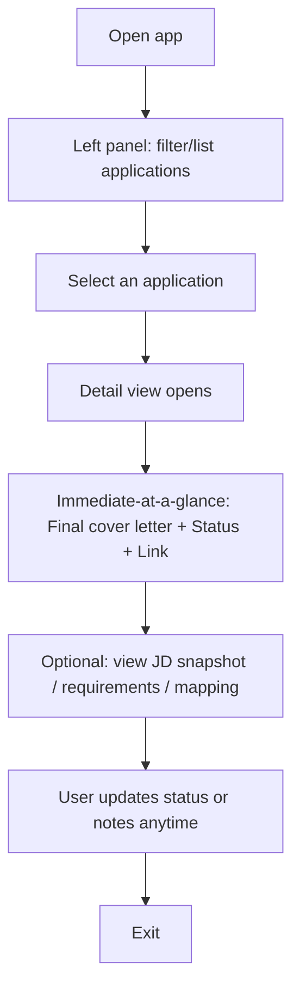

# UX Design Specification {{project_name}}

**Author:** {{user_name}}
**Date:** {{date}}

---

<!-- UX design content will be appended sequentially through collaborative workflow steps -->

## Executive Summary

### Project Vision

Job-Tracker is a desktop-first, SPA-style personal productivity tool that helps an Australian IT Master’s new graduate move from “job found” to “application-ready” with minimal friction. The experience is optimized for a nightly workflow: find roles across Seek/LinkedIn/company sites, capture a job via link, extract requirements, confirm evidence-based mapping to project experience, generate a ready-to-submit cover letter draft, and keep applications traceable for later follow-up and review.

The core UX promise is “no busywork, no lost context”: less copy/paste, fewer mental switches, reliable recovery when parsing or generation fails, and always being able to retrieve what was submitted.

### Target Users

- Primary user: A single user (the product creator) who is an Australian IT Master’s new graduate targeting Frontend/SWE roles (desktop Chrome usage, nightly sessions).
- Skill level: Tech-savvy and comfortable with structured inputs (project/evidence library), willing to sign in (Supabase), and tolerant of AI latency if the workflow remains clear and controllable.
- Motivation: High-throughput, high-relevance applications with evidence-based personalization and strong traceability.

### Key Design Challenges

- Designing a fast, low-cognitive-load “nightly pipeline” that supports repeated actions without fatigue.
- Making “mapping-first” feel effortless: requirements ↔ project bullets must be reviewable, editable, and confirmable without becoming a chore.
- Handling failure gracefully (link parsing failures, weak/long JDs, generic drafts) while preserving user trust and avoiding dead ends.
- Supporting traceability without turning the product into a spreadsheet: users must retrieve final submitted cover letters quickly and reliably.

### Design Opportunities

- Keyboard-first, frictionless capture flow (paste link → immediate structured record) with clear fallback to manual JD paste.
- Confidence-building UX around grounding: show clear evidence connections and make “why this text exists” feel explainable.
- Smart defaults and progressive disclosure to keep the UI calm while still enabling power-user control when needed.
- A consistent recovery loop for the top failure modes (parse failure, weak JD, poor mapping, generic output) that keeps the user in control.

## Core User Experience

### Defining Experience

The core experience of Job-Tracker is a nightly “capture-to-draft” loop: the user pastes a job link and quickly moves through a short, guided flow that turns a posting into an application-ready cover letter draft grounded in their own project evidence. The product’s UX success is defined by how little the user has to think while progressing through the loop.

Although the workflow contains multiple steps (parse → extract → confirm mapping → generate), it should feel like one continuous action: “I paste a link, and I’m already applying.”

### Platform Strategy

- Desktop-first web app with SPA navigation, optimized for mouse/keyboard in desktop Chrome.
- No keyboard-first power workflow is required; the UX should remain simple and visually guided.
- The app should keep the user oriented during AI operations with clear progress states and an obvious recovery path.

### Effortless Interactions

The following interactions must feel effortless and low-friction:

1. **Paste link → Parse**
   - The user pastes a job URL and immediately sees a structured application record (or a clear fallback path if parsing fails).
2. **Extract responsibilities**
   - The system produces a clean, usable set of responsibilities/requirements from the JD with minimal user cleanup.
3. **Generate cover letter draft**
   - After the user confirms key evidence mapping, the system generates a cover letter draft that is usable as a submission baseline (the user can do light edits).

### Critical Success Moments

- **Success (“this is better”) moment:** The user pastes a link and quickly reaches a credible, grounded cover letter draft without manual copy/paste work.
- **Make-or-break failure:** Link parsing fails repeatedly or feels unreliable, forcing the user back into manual busywork and breaking trust.

### Experience Principles

- **Nightly-flow first:** Optimize for short, repeatable evening sessions (find → apply → record → review).
- **No dead ends:** Every failure mode (especially parsing) must have a visible, low-effort recovery path.
- **Evidence before words:** Keep the “why” behind the text anchored to confirmed project evidence so drafts don’t feel generic.
- **Minimal cognitive load:** Reduce decisions and cleanup steps; prefer smart defaults and progressive disclosure.

## Desired Emotional Response

### Primary Emotional Goals

- **In control:** The user should feel they are always driving the process—able to review, adjust, confirm, retry, or skip without getting stuck.
- **Efficient:** The experience should feel like a smooth nightly workflow that removes busywork and compresses time-to-application-ready.

### Emotional Journey Mapping

- **First-time experience:** Simple and easy to understand—clear next steps, minimal choices, low intimidation.
- **During the core loop (paste → parse → extract → map → generate):** A “magical but grounded” feeling—fast progress with visible evidence of what the system is doing.
- **After completion (draft ready + record saved):** Relief and confidence—“I’m done, it’s saved, I can trust this later.”
- **When things go wrong (parse/generation failures):** Calm reliability—clear explanation, obvious recovery paths, and the ability to **cancel or retry** without losing work.

### Micro-Emotions

- **Trust vs. Skepticism (critical):**
  - The UI must continuously earn trust via transparency (what was extracted, what is mapped, why a draft is written this way) and safety nets (undo, retry, fallback).
  - Avoid “black box” leaps that force the user to guess what happened.

### Design Implications

- **Make recovery effortless:** Retry is a first-class action for parsing and generation; failures never trap the user.
- **Progressive disclosure:** Show only what’s needed now, but make “details” available when the user wants reassurance.
- **State persistence:** Never make the user re-enter the same information after an error; preserve drafts and intermediate outputs.
- **Confidence cues:** Use clear statuses, confirmations for mapping, and visible “saved” indicators to reduce anxiety and overload.

### Emotional Design Principles

- **Always a way out:** Every step supports cancel, back, retry, or fallback.
- **Explain without lecturing:** Show “just enough” explanation to build trust.
- **Small wins, frequent:** Each step should feel like visible progress toward “application-ready.”
- **Reliability over flash:** “Feels magical” only works if it is consistently dependable.

## UX Pattern Analysis & Inspiration

### Inspiring Products Analysis

**ChatGPT**
- Strength: ultra-low-friction primary action (one obvious input), fast perceived responsiveness, and a clear “conversation as history” model.
- Trust builders: visible progress/streaming, the ability to continue refining, and persistent context across a session.

**Claude Code**
- Strength: iterative “attempt → observe → adjust → retry” loop that keeps the user in control during complex operations.
- Trust builders: clear error states and recovery paths (retry), and a sense of forward motion even when something fails.

**VS Code**
- Strength: calm information hierarchy for complex work (editor vs sidebars), strong search/navigation, and recoverability (undo, revert, history).
- Trust builders: explicit state visibility (what changed, what’s saved), predictable interactions, and stable performance.

### Transferable UX Patterns

**Navigation & Information Hierarchy**
- Single, dominant primary workspace (application “record”) supported by secondary panels (requirements, mapping, project library, notes).
- Clear separation between “content” (JD, cover letter) and “controls” (status, actions).

**Interaction Patterns**
- One obvious “primary action” entry point (paste link / paste JD) with progressive disclosure for advanced steps.
- “Review → confirm → generate” gates for trust: users explicitly confirm mapping before generation.
- Fast iteration loops with minimal re-entry: when something fails, retry should not require redoing earlier work.

**Visual/Feedback Patterns**
- Strong state visibility (“parsed”, “needs JD paste”, “requirements extracted”, “mapping confirmed”, “draft ready”, “saved”).
- Clear, human-readable error messages with actionable next steps.

### Anti-Patterns to Avoid

- **Unreliability:** silent failures, inconsistent parsing results, or disappearing drafts break trust immediately.
- **Operational complexity:** too many choices at once, long forms before value, or requiring users to “learn the tool” before it helps.

### Design Inspiration Strategy

**What to Adopt**
- Input-first flow with a single clear starting point (paste link) and immediate visible progress.
- Trust-first workflow gating (mapping confirmation before generation).
- Strong state visibility and “always recover” error handling (retry without losing work).

**What to Adapt**
- VS Code-like information hierarchy, but simplified for a single-user nightly workflow (avoid power-user overload).
- LLM iteration patterns (refine/regenerate) while keeping it controlled and evidence-grounded.

**What to Avoid**
- Hidden system state, ambiguous progress, and any experience that forces the user back into manual busywork after failures.
- Complex multi-step setup before delivering the first meaningful win.

## Design System Foundation

### 1.1 Design System Choice

**Chosen approach:** Themeable system using **Tailwind CSS + shadcn/ui** (desktop-first web app, Chrome supported).

### Rationale for Selection

- **Speed-first (solo builder):** shadcn/ui provides production-ready components and patterns without heavy framework overhead.
- **Tool-like clarity (VS Code-inspired):** a neutral, utilitarian UI helps the user feel in control and reduces cognitive load during repetitive nightly workflows.
- **Themeable consistency:** Tailwind tokens + component primitives make it easy to keep spacing, typography, and states consistent (critical for trust).
- **Good-enough accessibility baseline:** components and patterns can be implemented with sensible focus states, labels, and contrast (aligned with “baseline usable” accessibility).

### Implementation Approach

- Use shadcn/ui component primitives as the default building blocks (forms, dialogs, tables/lists, tabs, toasts).
- Establish a small set of design tokens (color, typography, spacing, radii) and apply them consistently across components.
- Prefer predictable UI patterns over novelty:
  - Clear states (saved/loading/error)
  - Visible progress during AI operations
  - First-class retry paths for parsing and generation failures

### Customization Strategy

- **Visual direction:** VS Code-like “calm tool” aesthetic (neutral surfaces, clear hierarchy, minimal ornamentation).
- **Scope of customization:** keep customization light in MVP (mostly tokens and component variants) to preserve development speed.
- **Future flexibility:** allow incremental enhancements (dark mode, stronger branding, richer theming) without reworking core components.

## 2. Core User Experience

### 2.1 Defining Experience

**Defining experience (one-liner):**
Paste a job link → confirm evidence mapping → get an application-ready cover letter in minutes, and track the progress status for that application.

This interaction is the product’s signature: it compresses a fragmented, manual workflow into a single guided loop that ends with both output (a usable draft) and traceability (an updated pipeline record).

### 2.2 User Mental Model

The user approaches Job-Tracker with a hybrid mental model:
- **Spreadsheet/table mindset (Excel/Notion):** “I’m recording and organizing applications with structured fields.”
- **Content generation mindset (chat-like):** “I’m generating and refining application materials.”

The UX should satisfy both:
- Provide a stable, structured “application record” as the source of truth.
- Provide an iterative generation experience (with retry and refinement) that feels guided and safe.

### 2.3 Success Criteria

The defining experience is successful when:
- **High parsing success rate** for the primary source (Seek) and acceptable best-effort behavior for other sources (with immediate fallback).
- **Fast correction loop:** when parsing/extraction is wrong, the user can correct it quickly without re-entering everything.
- **Non-generic drafts:** the cover letter reads like it is grounded in the user’s evidence, not templated fluff.
- **Clear mapping:** the requirement → project bullets mapping is visible, editable, and confirmable with minimal effort.

### 2.4 Novel UX Patterns

This experience should use **established patterns**:
- A guided step flow (wizard-like) for paste → parse → extract → map → generate.
- A structured record view (table/list + detail panel) for tracking and retrieval.
- A predictable retry/recovery model for failures.

Innovation should be limited to combining these familiar patterns into a seamless, low-cognitive-load loop.

### 2.5 Experience Mechanics

**1. Initiation**
- The user starts by pasting a job link into a clearly dominant entry point.
- The system immediately shows a new application record in a “processing” state.

**2. Interaction**
- The system attempts to parse and extract job details; the user can edit any fields.
- The system extracts responsibilities/requirements; the user can confirm or refine.
- The system proposes evidence mapping; the user edits and confirms.

**3. Feedback**
- The UI continuously shows state and progress (parsed / needs input / ready to confirm / draft ready / saved).
- Errors are actionable and recoverable (retry, fallback to manual JD paste, keep previous inputs).

**4. Completion**
- The user receives a ready-to-submit cover letter draft and can save the final version.
- The application status is visible and editable, enabling progress tracking and later retrieval.

## Visual Design Foundation

### Color System

**Default mode:** Light (tool-like, calm, reliable)

**Theme baseline: Studio Light (VSCode-inspired)**
- Background: #F5F5F5
- Surface: #FFFFFF
- Border: #E5E7EB
- Text (primary): #111827
- Text (muted): #6B7280
- Primary accent (blue): #2563EB
- Success: #16A34A
- Warning: #D97706
- Error: #DC2626

**Semantic mapping:**
- Primary = main CTA and selected states
- Neutral surfaces = reduce cognitive load
- Status colors = success/warning/error for parse/generation states and toasts

### Typography System

- Default system: shadcn/ui defaults (e.g., `Inter` if included, otherwise system UI stack)
- Hierarchy: clear but restrained (tool-like)
  - H1: page titles only
  - H2/H3: section headers inside detail pages
  - Body: readable, not large; optimized for scanning requirements/mapping lists
- Copy tone: concise, action-oriented microcopy (“Retry”, “Paste JD”, “Confirm mapping”)

### Spacing & Layout Foundation

- Density: balanced (not cramped, not airy)
- Base spacing unit: 8px rhythm (with 4px sub-steps for tight controls)
- Layout: “workspace + side panels” pattern
  - Left: navigation / application list
  - Center: primary workspace (application record)
  - Right: contextual panels (requirements, mapping, project bullets) as needed
- Forms: short sections with progressive disclosure (avoid long intimidating forms)

### Accessibility Considerations

- Baseline usable accessibility:
  - visible focus states for interactive controls
  - labeled inputs and clear validation messages
  - sufficient contrast for primary text and critical states

## Design Direction Decision

### Design Directions Explored

We explored multiple layout directions for a desktop-first, tool-like SPA optimized for a nightly workflow:
- 3-panel workspace (list + primary record + contextual side panel)
- 2-panel list + detail (reduced side context)
- Triage-first wide list (scanning speed)
- Wizard-like guided flow (one obvious next step)
- Capture-first single surface (minimal chrome)
- Mapping-emphasis layouts (more space for evidence confirmation)
- Minimal calm navigation variants
- Developer-tool aesthetic variants (mono hierarchy cues)

### Chosen Direction

**Chosen Direction:** D1 — 3-panel workspace

**Key Elements**
- Left: application list + dominant “paste link” entry point for nightly capture.
- Center: primary “Application Record” workspace (structured fields + core actions).
- Right: contextual panel for mapping-first support (requirements ↔ project bullets, project library snippets, recovery guidance).

### Design Rationale

D1 best supports the emotional and usability goals:
- **In control:** information and actions are always visible and predictable; user can correct, confirm, retry without hunting.
- **Trust-building:** contextual panel makes evidence and mapping tangible rather than “black box” AI.
- **Efficiency:** the nightly loop is optimized for repeated actions with minimal navigation churn.
- **No dead ends:** the layout naturally accommodates recovery paths (retry parse, paste JD fallback, regenerate) without breaking the user’s flow.

### Implementation Approach

- Implement D1 as the default application shell using Tailwind + shadcn/ui:
  - Left navigation (list + filters + paste link input)
  - Center detail view (tabs for requirements/mapping/cover letter + status/notes)
  - Right contextual panel (mapping confirmation, project bullet picker, system state and recovery actions)
- Keep interactions visually guided (not keyboard-first), with strong state visibility (“parsed”, “needs JD paste”, “mapping confirmed”, “draft ready”, “saved”).
- Treat retry/fallback as first-class UI actions to protect trust when parsing/generation fails.

## User Journey Flows

### Journey 1: Nightly “Find → Apply → Record” (Happy Path)

User intent: paste a job link, get a usable draft quickly, then refine toward an evidence-grounded final and record status.

```mermaid
flowchart TD
  A[Start: Night session] --> B[Paste job link (left panel)]
  B --> C{Parse success?}
  C -- Yes --> D[Auto-fill company/role/location + JD snapshot]
  C -- No --> E[Fallback: Paste JD + enter company + role]
  E --> F[Extract responsibilities/requirements]
  D --> F

  F --> G[User reviews/edit extracted requirements]
  G --> H{Generate draft now?}
  H -- Yes --> I[Generate \"Preview Draft\" (Ungrounded) + label clearly (Post-MVP)]
  H -- No --> J[Proceed to mapping]

  I --> K[Show draft + callout: \"Ungrounded preview\" (Post-MVP)]
  K --> J[Proceed to mapping]

  J --> L[System proposes requirement → project bullet mapping]
  L --> M[User adjusts mapping + confirms]
  M --> N[Generate \"Final Draft\" (Evidence-grounded)]
  N --> O[User edits + Save final version]
  O --> P[User updates status (any time) + applied date + notes]
  P --> Q[End: record is saved + traceable]
```

Key UX notes:
- “Generate draft” before mapping is explicitly labeled as Preview/Ungrounded to preserve trust (Post-MVP enhancement).
- Final draft generation is gated by mapping confirmation to ensure non-generic, evidence-based output.

---

### Journey 2: Parse Fails / JD Is Weak (Recovery + Control)

User intent: never hit a dead end; when parsing fails or JD is low-signal, keep moving with low friction.

```mermaid
flowchart TD
  A[Paste job link] --> B{Parse success?}
  B -- No --> C[Show clear error + primary CTA: \"Paste JD\"]
  C --> D[User pastes JD + enters company + role]
  D --> E[Extract requirements]
  B -- Yes --> E

  E --> F{JD quality low-signal?}
  F -- Yes --> G[Show responsibilities list as checkboxes]
  G --> H[User selects top responsibilities]
  F -- No --> I[Show extracted requirements]
  H --> I

  I --> J[User edits/corrects requirements quickly]
  J --> K[Optional: Preview Draft (Ungrounded) (Post-MVP)]
  K --> L[Mapping proposal]
  L --> M[User confirms mapping]
  M --> N[Final Draft (Grounded)]
```

Key UX notes:
- No persistent “Retry parse” requirement; recovery is optimized via JD paste + minimal required fields.
- Checkbox-based responsibility selection reduces overwhelm on watery JDs.

---

### Journey 3: Review & Retrieve What I Sent (Traceability)

User intent: quickly find an application and access the final cover letter + status + link without hunting.



Key UX notes:
- Retrieval is list-driven (filters/search in left panel), not global-command style.
- The first visible content prioritizes “what was submitted” (final cover letter), then status and link.

---

### Journey Patterns

- **State visibility everywhere:** parsed / needs JD paste / requirements ready / mapping confirmed / preview draft (Post-MVP) / final draft / saved.
- **Progressive disclosure:** users see only what they need now; deeper context (JD snapshot, mapping details) is available when desired.
- **Never re-enter work:** parsing/generation failures keep the application record intact; user continues from the last stable state.
- **Two-tier drafting (Post-MVP):** Preview (ungrounded) vs Final (evidence-grounded) to balance speed and trust.

### Flow Optimization Principles

- Minimize steps-to-value (paste link → usable draft) while preserving a trust-building path to an evidence-grounded final.
- Make recovery paths more prominent than error explanations.
- Keep the “nightly loop” consistent across sources: Seek/LinkedIn/company site all converge into the same record + extraction + mapping + drafting pipeline.

## Component Strategy

### Design System Components

Use Tailwind + shadcn/ui for foundation components:
- Buttons (primary/secondary/ghost), Icon buttons
- Inputs (text/url), Textarea (JD paste), Select, Checkbox, Switch
- Tabs (Requirements / Mapping / Cover letter), Badge/Chip (status/source)
- Dialog/Modal (confirm actions), Sheet/Drawer (optional)
- Toasts (success/error), Tooltip, Dropdown menu
- List/Table patterns for applications
- Date input (applied date) if needed

These components should remain visually consistent and restrained (VS Code-like “calm tool”).

### Custom Components

#### PasteLinkCapture

**Purpose:** Provide the single dominant entry point for the nightly workflow: paste a job link and immediately see the system state (parsing, success, failure) with a clear recovery path.  
**Usage:** Left panel header (always visible).  
**Anatomy:** URL input + source hint + parsing status + primary recovery CTA (“Paste JD”).  
**States:**
- Default (empty)
- Parsing (loading)
- Parsed (success)
- Parse failed (error + Paste JD CTA)
- Disabled (when offline or not signed in)
**Variants:** Compact (sidebar) only.  
**Accessibility:** Labeled input, status region announced to screen readers, focus stays predictable after submit/failure.  
**Content Guidelines:** Keep microcopy short and action-oriented (“Paste link”, “Parsing…”, “Paste JD”, “Retry”).  
**Interaction Behavior:** Submitting creates/opens a new application record in the center panel; failures never block progress.

#### MappingWorkbench

**Purpose:** Make evidence-grounding tangible: review and confirm requirement → project-bullets mapping before producing a “Final Draft”.  
**Usage:** Right contextual panel during mapping and refinement.  
**Anatomy:** Requirements list + selected evidence bullets + uncovered indicator + confirm mapping action.  
**States:**
- Empty (no requirements yet)
- Proposed mapping (editable)
- Uncovered requirements highlighted
- Confirmed mapping (locked but revisitable)
- Error (failed to load project library)
**Variants:** “Quick confirm” (minimal) vs “Deep mapping” (expanded) depending on density.  
**Accessibility:** Checkbox/list semantics, keyboard reachable controls, clear labels for “confirm mapping”.  
**Content Guidelines:** Prefer concise requirement labels; show evidence bullets as short, impact-oriented statements.  
**Interaction Behavior:** Confirmation gates “Final Draft” generation; Preview Draft without confirmation is a Post-MVP enhancement.

#### DraftStatusBanner

**Purpose:** Keep the user in control with continuous state visibility and the correct next action.  
**Usage:** Top area of the center “Application Record” panel.  
**Anatomy:** Status label + optional explanation + primary/secondary actions (Retry parse, Paste JD, Generate preview (Post-MVP), Confirm mapping, Generate final, Save).  
**States:**
- Parsed / Needs JD / Requirements ready / Mapping pending / Mapping confirmed
- Preview Draft (Ungrounded) (Post-MVP)
- Final Draft (Evidence-grounded)
- Saved
- Error (parse/generation) with Retry
**Variants:** Minimal (just status + 1 CTA) vs Expanded (status + explanation + 2 CTAs).  
**Accessibility:** Announce status changes, preserve focus, avoid “jumping UI”.  
**Content Guidelines:** Never blame the user; always offer a next step (“Retry”, “Paste JD”, “Continue”).  
**Interaction Behavior:** One primary CTA per state to reduce overwhelm.

### Component Implementation Strategy

- Compose custom components strictly from design system primitives and the chosen tokens (Studio Light).
- Treat state visibility and recovery actions as first-class UX (retry, fallback, preserve inputs).
- Avoid over-customizing visuals; focus on predictable behavior and clear states.

### Implementation Roadmap

**Phase 1 - Core Components (MVP-critical)**
- PasteLinkCapture
- DraftStatusBanner
- MappingWorkbench
- ApplicationList + ApplicationDetailShell (D1 layout scaffolding)

**Phase 2 - Supporting Components**
- Requirements editor (inline edit), low-signal JD responsibility selector (checkbox list)
- Project bullet picker enhancements (search/filter tags)

**Phase 3 - Enhancements**
- More refined “preview vs final” version labeling
- Additional quality-of-life components (bulk list actions, richer filters)

## UX Consistency Patterns

### Button Hierarchy

- **Primary (1 per view/state):** Verb-first CTA for the “next best action” (e.g., “Generate preview”, “Confirm mapping”, “Generate final”, “Save final”).
- **Secondary:** Supporting actions that don’t advance the main state (e.g., “Edit requirements”, “View JD snapshot”).
- **Tertiary/Ghost:** Non-critical navigation or low-risk actions.
- **Destructive:** Clearly styled destructive actions (e.g., “Delete application”, “Delete account”) and always gated by confirmation.

### Feedback Patterns

- **Global feedback:** Use **Toast** for success/error/warning notifications.
- **State feedback:** Use **DraftStatusBanner** (top of application record) as the persistent “truth” of what’s happening now (parsed / needs JD / preview / mapping confirmed / saved).
- **Error handling pattern (trust-first):**
  - Toast communicates the outcome (“Parsing failed”, “Generation failed”).
  - Banner provides the recovery path (“Paste JD”, “Retry”, “Continue without parsing”).
- **Success pattern:** Show “Saved” in the banner + optional toast (“Saved final cover letter”).

### Form Patterns

- **Explicit save:** Edits are not considered final until the user clicks an explicit Save action.
- **Validation:** Inline field-level validation for required fields (company, role, JD snapshot) with clear messages; toast used only for cross-field/system failures.
- **Progressive disclosure:** Short forms by default; advanced fields (visa notes, tags) are optional and collapsed when not needed.

### Navigation Patterns (D1)

- **Left panel:** Application list + filters (company/date/status) + dominant “Paste link” entry.
- **Center panel:** Application record workspace with tabs (Requirements / Mapping / Cover letter).
- **Right panel:** Context and mapping workbench; collapsible when not needed to reduce overwhelm.
- **Navigation principle:** “One place for truth” — the application record is the canonical view of status, link, and final cover letter.

### Empty / Loading States

- **Empty states:** Always include a next action (e.g., “Paste a job link to start”, “Paste JD to continue”).
- **Loading states:** Always show clear progress copy (e.g., “Parsing…”, “Extracting requirements…”, “Generating…”, “Retrying…”).
- **No dead ends:** Every loading/error state offers a visible escape hatch (cancel, retry, fallback).

### Search & Filtering Patterns

- **Primary filters:** company, date, status (left panel).
- **List behavior:** filtered results update predictably; selection persists when possible.
- **Detail linkage:** selecting an item always opens the center record; retrieval prioritizes final cover letter + status + link.

## Responsive Design & Accessibility

### Responsive Strategy

- **Desktop-first SPA:** The product is optimized for desktop Chrome usage and nightly high-throughput sessions.
- **Minimum usable width:** Layout remains usable down to **768px** window width.
- **Narrow-window behavior (D1):**
  - Primary adaptation is collapsing the **left application list** into a compact icon rail or an expandable drawer.
  - The center “Application Record” remains the primary workspace and should stay stable.
  - The right contextual panel may remain available when space allows; if not, it can be toggled as needed.

### Breakpoint Strategy

- **Desktop breakpoints (desktop-first):**
  - ≥ 1200px: Full D1 layout (left list + center record + right context).
  - 900–1199px: Left list may reduce density; right panel may be toggled.
  - 768–899px: Left list collapses (drawer/rail); center record dominates; optional context is accessible via toggle.
- Mobile-first layout is not required; mobile browsers are out of scope for MVP.

### Accessibility Strategy

- **Target:** WCAG **Level A (Basic)** for a personal productivity tool.
- **Baseline requirements:**
  - Keyboard operability for core flows (tab order, focus states).
  - Labeled form controls and actionable error messages.
  - Clear focus indicators and non-ambiguous control naming.
  - Adequate contrast for primary text and critical states (parse/generation errors).

### Testing Strategy

- **Primary:** Desktop Chrome (latest stable).
- **Responsive testing:** Verify usability across the breakpoint ranges above using window resizing.
- **Accessibility testing:** Keyboard-only pass for critical flows and basic automated checks (lint/axe where feasible).

### Implementation Guidelines

- Use flexible layout primitives (CSS grid/flex) to support the 768px minimum.
- Ensure the left panel collapse/expand behavior is predictable and preserves selection state.
- Preserve state and focus during async operations (parsing/generation) to prevent disorientation.
